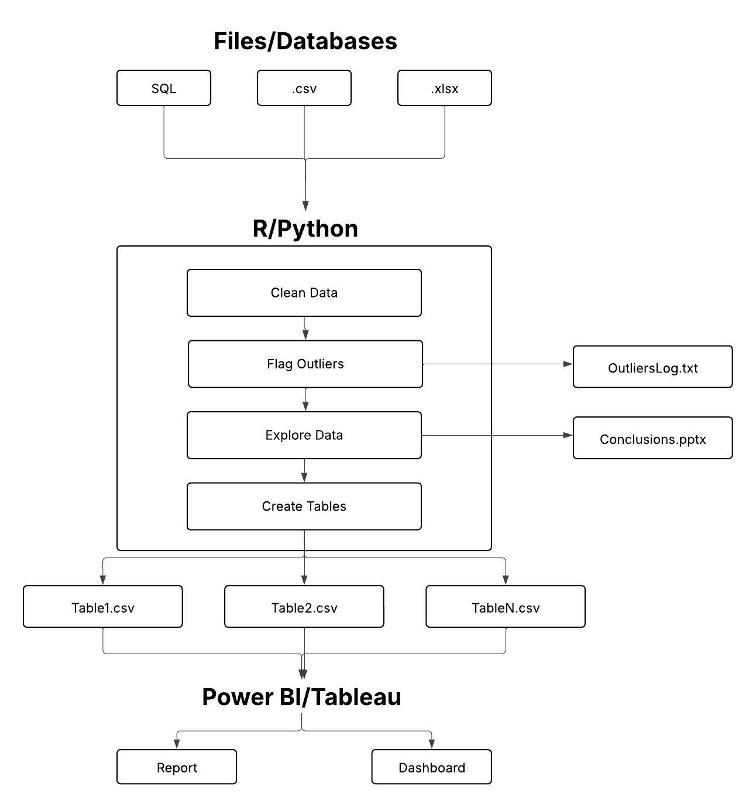

# Data Analysis Projects

## Navigation

[Show projects by skill](#by-skill)  

[Show projects by program/language](#by-programlanguage) 

[Show projects by data category](#by-data-category)

## My process

This displays my typical process for data analysis, which automates most of the process as possible before exporting tables for use with Power BI/Tableau. 

## By skill

### Data gathering, data cleaning, data manipulation

* Gathering data: [Fangraphs baseball data](https://github.com/atamalu/Scraping-Fangraphs), [NFL data](https://github.com/atamalu/Intro-to-NFL-Data?tab=readme-ov-file)
* [Data manipulation using R, Python, and SQL](https://github.com/atamalu123/data_manipulation_practice)

### Data exploration, visualization

* [Exploring COVID loan data](https://github.com/atamalu/covid_loans)
* [Exploring American citizens' water intake using .gov data](https://github.com/atamalu123/NHANES)
* [Exploring baseball data](https://github.com/atamalu/Scraping-Fangraphs/blob/master/Pt_3_Data_Exploration.md)
* [Exploring NFL data](https://github.com/atamalu/Intro-to-NFL-Data/blob/master/Week_1_Exploration_All.md)

### Statistics, hypothesis testing, machine learning

* [Applied statistics and hypothesis testing](https://github.com/atamalu/Applied-Stats-Sims)

### Dashboards, reports

* [Finished dashboards from previous clients](https://github.com/atamalu123/dashboards)

## By program/language

### Power BI

* [Finished dashboards from previous clients](https://github.com/atamalu123/dashboards)

### SQL

* [Leetcode SQL challenges](https://github.com/atamalu123/data_manipulation_practice)

### R

* [Exploring individuals' water intake using .gov data](https://github.com/atamalu123/NHANES)
* [R Package for analyzing and visualizing fiber photometry data](https://github.com/atamalu/fluoR) and its [Online companion book](https://bookdown.org/anta8363/fluoR_bookdown/)
* Gathering and analyzing sports data: [MLB](https://github.com/atamalu/Scraping-Fangraphs), [NFL](https://github.com/atamalu/Intro-to-NFL-Data)
* [Applied statistics and hypothesis testing](https://github.com/atamalu/Applied-Stats-Sims)
* [Exploring COVID loan data](https://github.com/atamalu/covid_loans)

### Python

*  [Functions to control the BlueStacks android emulator](https://github.com/atamalu/BlueStacksADB)

## By data category

### Supply chain

* [Supply chain dashboard](https://github.com/atamalu123/dashboards/blob/main/supply_chain_management.jpg)

### Health

* [Exploring individuals' water intake using .gov data](https://github.com/atamalu123/NHANES)

### Finance, sales

* [Sales and inventory dashboard](https://github.com/atamalu123/dashboards/blob/main/sales_and_inventory.jpg)
* [Sales dashboard](https://github.com/atamalu123/dashboards/blob/main/supply_chain_and_sales.jpg)

### Math and Science

* [Applied statistics and hypothesis testing](https://github.com/atamalu/Applied-Stats-Sims)

### Sports

* [Baseball (MLB)](https://github.com/atamalu/Scraping-Fangraphs)
* [Football (NFL)](https://github.com/atamalu/Intro-to-NFL-Data)

### Other

* [Exploring COVID loan data](https://github.com/atamalu/covid_loans)
* [Leetcode SQL challenges](https://github.com/atamalu123/data_manipulation_practice)
